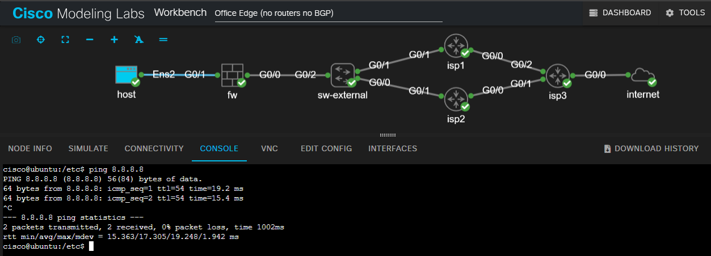

# Office Edge No Router No BGP

## Design Objective

This design is for offices with dual Internet connections and firewalls at the trust and untrust edge. 

### Pros
- Small edge kit (firewall(s))
- ISP load balancing
- Low complexity
- Dynamic redundancy
### Cons
- ISP link health is determined by IP SLA. This method can be problematic depending on which SLA targets you specify.
- No traffic engineering
  
## Workspace

  