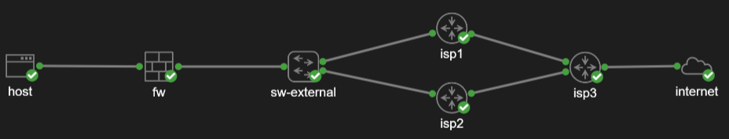

# Welcome

My name is Henry Moats and I'm a networking professional with hands-on experience in enteprise and production private and public cloud infrastructure, automation, monitoring, performance, security and availability. Please see my **[resume](/docs/Henry-Moats-Resume-For-Github-IO.pdf)** for more details.

If you'd like to send me a message, you can reach me on **[LinkedIn](https://linkedin.com/in/hmoats)**

  
---

### Topics

#### Observability
- [Cacti monitoring deployment](https://github.com/hmoats/cacti)
- Oxidized Deployment

#### Tools
- [Ansible playbooks](https://github.com/hmoats/group-ansible)
- [Various tools](https://github.com/hmoats/group-net-tools)

#### Design
- [Small Office Build Project](https://github.com/hmoats/group-design-docs-public/tree/master/Small-Office-Build-Project1)
- [Enterprise Office Build Project](https://github.com/hmoats/group-design-docs-public/tree/master/Enterprise-Office-Build-Project1)
- [Dell and BigSwitch Network Build](https://github.com/hmoats/group-design-docs-public/tree/master/Dell-and-BigSwitch-Network-Build-Project)
- [Cisco L3 Leaf and Spine Fabirc](https://github.com/hmoats/group-design-docs-public/tree/master/Cisco-L3-Spine-Leaf-Network-Build-Project) 
  
#### Labs
- [Office Edge with No Router, No BGP](/docs/VIRL-Labs/Office-Edge-No-Router-No-BGP/README.md)
- [Enterprise Site to Site VPNs with VTIs and BGP](/docs/Cisco/Enterprise-Site-to-Site-VPN-with-ASA-VTIs.md)
- [Resilient Enterprise Firewall Edge](/docs/Cisco/Resilient-Enterprise-Firewall-Edge.md)
- [Resilient Router Edge](/docs/Cisco/Resilient-Enterprise-Router-Edge.md)

#### Projects
- [Deploying Kubernetes on AWS Using kops](/docs/kops/Deploying-kubernetes-on-AWS-using-kops.md)

